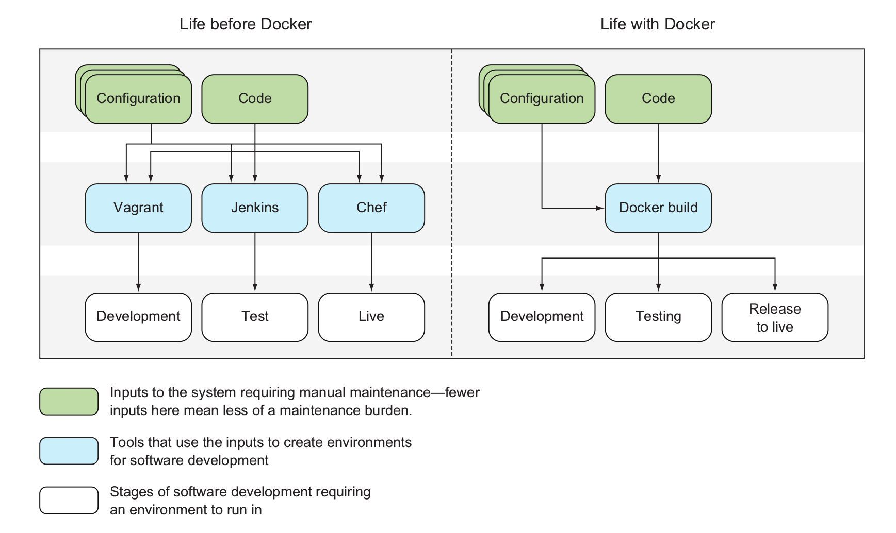

## 统一开发测试运行环境

在Docker出现之前，开发流程通常包括用于管理软件移动的各种技术的组合，例如虚拟机，配置管理工具，不同的包管理系统以及复杂的库依赖关系网。 所有这些工具都需要由专业工程师进行管理和维护，而且大多数都有自己独特的配置方式。

Docker改变了所有这一切，允许参与此过程的不同工程师有效地说一种语言，使一起工作变得轻而易举。 所有东西都通过一个公共管道连接到可以在任何目标上使用的单个输出 - 不需要继续维护一系列令人眼花缭乱的工具配置，如下图所示：

## 优势所在

作为一种新兴的虚拟化方式，Docker 跟传统的虚拟化方式相比具有众多的优势。

### 更高效的利用系统资源

由于容器不需要进行硬件虚拟以及运行完整操作系统等额外开销，Docker 对系统资源的利用率更高。无论是应用执行速度、内存损耗或者文件存储速度，都要比传统虚拟机技术更高效。因此，相比虚拟机技术，一个相同配置的主机，往往可以运行更多数量的应用。

### 更快速的启动时间

传统的虚拟机技术启动应用服务往往需要数分钟，而 Docker 容器应用，由于直接运行于宿主内核，无需启动完整的操作系统，因此可以做到秒级、甚至毫秒级的启动时间。大大的节约了开发、测试、部署的时间。

### 一致的运行环境

开发过程中一个常见的问题是环境一致性问题。由于开发环境、测试环境、生产环境不一致，导致有些 bug 并未在开发过程中被发现。而 Docker 的镜像提供了除内核外完整的运行时环境，确保了应用运行环境一致性，从而不会再出现 *「这段代码在我机器上没问题啊」* 这类问题。

### 持续交付和部署

对开发和运维（[DevOps](https://zh.wikipedia.org/wiki/DevOps)）人员来说，最希望的就是一次创建或配置，可以在任意地方正常运行。

使用 Docker 可以通过定制应用镜像来实现持续集成、持续交付、部署。开发人员可以通过 [Dockerfile](../image/dockerfile/) 来进行镜像构建，并结合 [持续集成(Continuous Integration)](https://en.wikipedia.org/wiki/Continuous_integration) 系统进行集成测试，而运维人员则可以直接在生产环境中快速部署该镜像，甚至结合 [持续部署(Continuous Delivery/Deployment)](https://en.wikipedia.org/wiki/Continuous_delivery) 系统进行自动部署。

而且使用 `Dockerfile` 使镜像构建透明化，不仅仅开发团队可以理解应用运行环境，也方便运维团队理解应用运行所需条件，帮助更好的生产环境中部署该镜像。

### 更轻松的迁移

由于 Docker 确保了执行环境的一致性，使得应用的迁移更加容易。Docker 可以在很多平台上运行，无论是物理机、虚拟机、公有云、私有云，甚至是笔记本，其运行结果是一致的。因此用户可以很轻易的将在一个平台上运行的应用，迁移到另一个平台上，而不用担心运行环境的变化导致应用无法正常运行的情况。

### 更轻松的维护和扩展

Docker 使用的分层存储以及镜像的技术，使得应用重复部分的复用更为容易，也使得应用的维护更新更加简单，基于基础镜像进一步扩展镜像也变得非常简单。此外，Docker 团队同各个开源项目团队一起维护了一大批高质量的 [官方镜像](https://store.docker.com/search?q=&source=verified&type=image)，既可以直接在生产环境使用，又可以作为基础进一步定制，大大的降低了应用服务的镜像制作成本。

### 对比传统虚拟机总结

|   特性     |   容器    |   虚拟机   |
| :--------   | :--------  | :---------- |
| 启动       | 秒级      | 分钟级     |
| 硬盘使用   | 一般为 `MB` | 一般为 `GB`  |
| 性能       | 接近原生  | 弱于       |
| 系统支持量 | 单机支持上千个容器 | 一般几十个 |

### 参考资料

- [docker----从入门到实践：为什么要使用 Docker？](https://yeasy.gitbooks.io/docker_practice/content/introduction/what.html)

